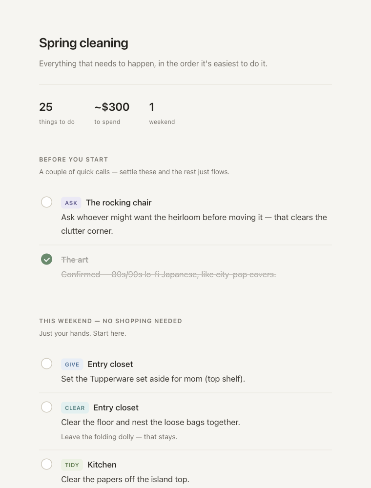

# walkthrough-plan

A [Claude](https://claude.com/claude-code) skill that turns a **narrated video walkthrough of a space** into a room-by-room cleanup and redecoration plan — a markdown checklist plus a calm, shareable HTML one-pager with a budget-tuned shopping list.

You record yourself walking through your place saying *"throw this out," "move this here," "I want art on this wall."* The skill transcribes the audio, visually analyzes the frames to figure out **what you were pointing at**, and produces a plan you can actually execute — phone in hand, ticking tasks off as you go.

<p align="center">
  
</p>

## What it produces

- **`PLAN.md`** — the canonical plan: a summary line, the decisions to make first, an effort-sorted checklist (Tier 1 = zero purchases this weekend, Tier 2 = after one shopping run), a "leave it alone" list, and a budget-tuned shopping list.
- **`index.html`** — a shareable one-pager (AirDrop it to your phone). Soft, calm design; checkboxes persist on the device as you tick them off.

It's built to prove it **understood the video** — the "leave it alone" list, the inline ⚠️ warnings ("measure the overhang first," "not a crate"), and the decisions pulled to the top are the signal that it listened, not just transcribed.

## Inputs

1. **A video** — point the skill at a `.mov`/`.mp4` walkthrough.
2. **A budget** — exact (`$300`) or general (`"on a budget"`, `"whatever it takes"`). The skill asks if you don't say.

## Requirements

- `ffmpeg` + `ffprobe`, `curl`, `python3`
- `OPENAI_API_KEY` in the environment (used for Whisper transcription)

## Install

Clone into your skills directory (or wherever your agent loads skills from):

```bash
git clone https://github.com/<you>/walkthrough-plan.git ~/.claude/skills/walkthrough-plan
```

Then just ask: *"turn this walkthrough video into a cleanup plan — budget's $300."*

## Example

Point it at a 7-minute phone video of someone walking through their apartment. It comes back with:

- a summary line — `25 things to do · ~$300 · 1 weekend`
- the **decisions to make first** (where does the heirloom chair go? approve the art style?)
- a **Tier 1** list of everything doable this weekend with bare hands, then **Tier 2** after one shopping run
- a **"leave it alone"** list of everything you said to keep — so nothing gets touched that shouldn't
- inline ⚠️ constraints it caught from the narration ("measure the overhang first," "not a crate")
- a shopping list tuned to the budget, one pick each, stable links with search-term fallbacks

The screenshot above is the actual rendered one-pager. Checkboxes persist on the device, so you can AirDrop it to your phone and tick things off as you walk the space.

## How it works

1. **`scripts/prep.sh`** extracts compressed audio, samples a frame every 5s, transcribes with Whisper, and writes a timestamped transcript (frames align to transcript timestamps).
2. A **subagent** views the frames against the transcript and returns text-only notes on each room's state and exactly what was being pointed at.
3. The skill synthesizes **`PLAN.md`**, then fills the `DATA` object in **`assets/onepager_template.html`** to render **`index.html`**.

## Repo layout

```
walkthrough-plan/
├── SKILL.md                      # the skill: instructions for the agent
├── scripts/
│   └── prep.sh                   # audio + frames + Whisper transcription
├── assets/
│   └── onepager_template.html    # the shareable one-pager (DATA-driven)
└── README.md
```

## License

MIT
